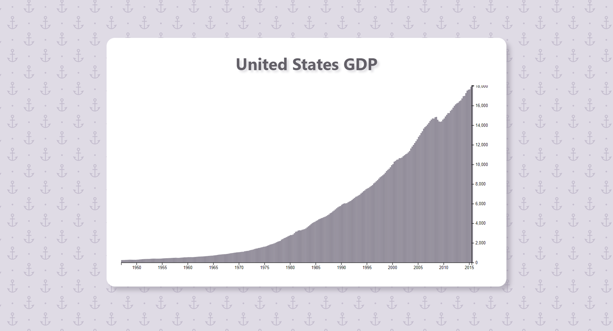
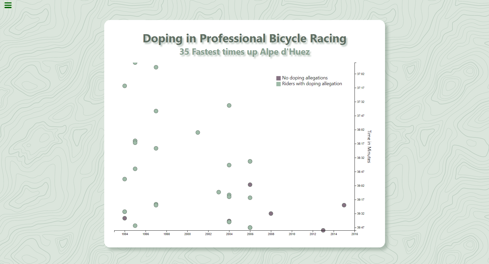
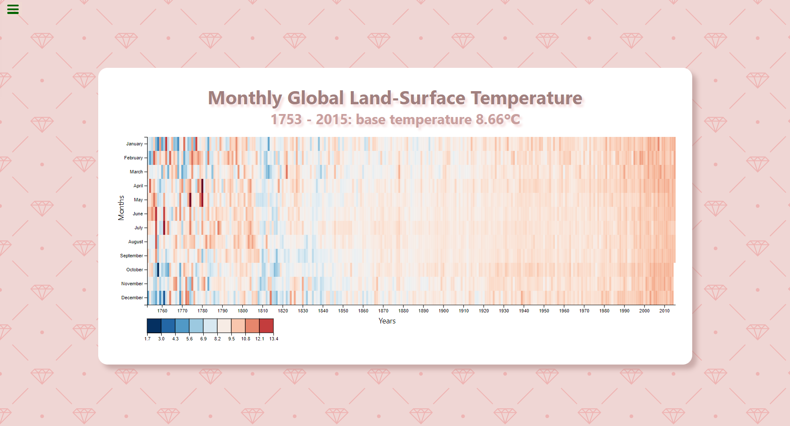
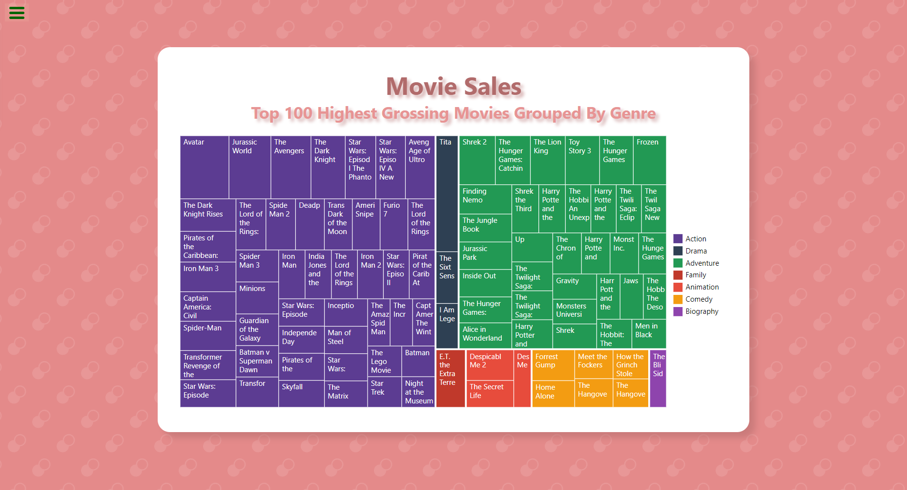

    <h1>Data Visualization</h1>
     
    

---

> These are the projects I completed during the *Data Visualization* course on the [**freeCodeCamp**](https://www.freecodecamp.org/) platform. Each project is organized in a folder with its respective name and the files are also available on the [**CodePen**](https://codepen.io) platform for viewing and editing.

---

# Bar Chart

# Scatterplot Graph

# Heat Map

# Treemap Diagram

---

# Credits

All patterns used in the background can be found on [Hero Patterns](https://heropatterns.com/).